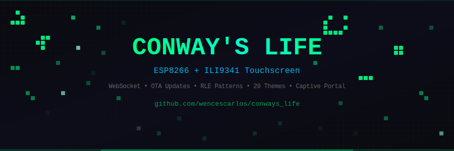

# 🔬 Conway's Game of Life — ESP8266 + ILI9341

<p align="center">
  
</p>

[](https://github.com/wencescarlos/conways_life/actions/workflows/build.yml)
[](LICENSE)
[%22&label=Firmware&color=blue&prefix=v)](https://github.com/wencescarlos/conways_life/releases)

Implementación completa del **Juego de la Vida de Conway** en un ESP8266 con pantalla táctil ILI9341 de 2.8", interfaz web en tiempo real, actualización OTA y editor de patrones.

## ✨ Características

**Pantalla TFT Táctil** — Simulación a 80×55 células, 20 temas de color, dibujo táctil, menú de configuración completo (velocidad, brillo, zona horaria, programación horaria), barra de estado interactiva.

**Interfaz Web en Tiempo Real** — WebSocket (puerto 81) para actualizaciones instantáneas, editor visual de cuadrícula, gráfico de población en vivo, 7 patrones clásicos predefinidos, guardar/cargar patrones personalizados en SPIFFS, importar/exportar formato RLE estándar.

**Sistema** — Actualización OTA protegida con contraseña, portal cautivo en modo AP, sincronización NTP, persistencia en EEPROM, detección de estancamiento con reinicio automático.

## 🔧 Hardware

| Componente | Descripción |
|---|---|
| Wemos D1 Mini | ESP8266 — 4MB Flash |
| ILI9341 2.8" TFT | Pantalla táctil 320×240 (XPT2046) |

### Conexiones

```
Wemos D1 Mini          ILI9341
──────────────         ─────────
D1 (GPIO5)     →  CS
D2 (GPIO4)     →  DC/RS
D8 (GPIO15)    →  LED (retroiluminación)
D3 (GPIO0)     →  T_CS (táctil)
D4 (GPIO2)     →  T_IRQ
D7 (GPIO13)    →  MOSI
D5 (GPIO14)    →  SCK
D6 (GPIO12)    →  MISO
3.3V           →  VCC
GND            →  GND
```

## 📦 Instalación

### Firmware pre-compilado

Descarga el `.bin` desde [Releases](https://github.com/wencescarlos/conways_life/releases) y flashea:

```bash
esptool.py --chip esp8266 --port /dev/ttyUSB0 --baud 921600 write_flash 0x0 conways_life_v2.0.bin
```

### Compilar desde código fuente

```bash
git clone https://github.com/wencescarlos/conways_life.git
cd conways_life
pio run --target upload
```

Las dependencias se instalan automáticamente. Los pines del TFT están configurados en `platformio.ini` (no necesitas editar `User_Setup.h`).

Para subir el sistema de archivos SPIFFS (necesario para patrones personalizados):

```bash
pio run --target uploadfs
```

### Actualización OTA

Si ya tienes el firmware instalado, desde la interfaz web:

1. Abre `http://IP_DISPOSITIVO`
2. Pulsa **🔄 Firmware** → selecciona el `.bin` → **Actualizar**
3. Credenciales: `admin` / `conway1234`

## 🚀 Primer Uso

1. Al alimentar el dispositivo, si no hay WiFi configurado, crea automáticamente una red AP:
   - **Red:** `ConwayLife-XXXXXX`
   - **Clave:** `conway1234`
2. Conéctate a esa red y se abrirá automáticamente la página de configuración (portal cautivo)
3. Configura tu WiFi y el dispositivo se reiniciará conectado a tu red
4. Accede desde el navegador a la IP asignada

## 📖 Uso

### Pantalla Táctil

| Zona | Acción |
|---|---|
| Cuadrícula | Toca para activar/desactivar células |
| Barra izquierda (`●WiFi MENU`) | Abre el menú principal |
| Barra derecha (`EJEC/PAUSA`) | Alterna simulación |
| Cualquier punto (pantalla apagada) | Enciende la pantalla |

### Interfaz Web

La web funciona como **editor de patrones**: al dibujar, cargar patrones o importar RLE, la simulación se pausa automáticamente. Cuando el diseño esté listo, pulsa ▶ Reanudar.

### Formato RLE

Importa y exporta patrones en el formato estándar de la comunidad. Miles de patrones disponibles en [ConwayLife.com](https://conwaylife.com/wiki/Main_Page).

```
#C Glider
x = 3, y = 3, rule = B3/S23
bo$2bo$3o!
```

## 🎨 Temas

| Categoría | Temas |
|---|---|
| Clásicos | Matrix, Monocromo, Ámbar, Fósforo |
| Naturaleza | Océano, Bosque, Atardecer, Aurora, Coral |
| Energía | Lava, Neón, Eléctrico, Plasma, Solar |
| Ambientes | Hielo, Medianoche, Desierto, Crepúsculo |
| Especiales | Retro, Cianotipia |

## 🔌 API

| Endpoint | Método | Descripción |
|---|---|---|
| `/api/grid` | GET/POST | Obtener/establecer cuadrícula |
| `/api/cell` | POST | Establecer célula individual |
| `/api/clear` | POST | Limpiar cuadrícula |
| `/api/random` | POST | Cuadrícula aleatoria |
| `/api/pause` | POST | Pausar |
| `/api/resume` | POST | Reanudar |
| `/api/step` | POST | Un paso |
| `/api/speed` | POST | Cambiar velocidad |
| `/api/theme` | POST | Cambiar tema |
| `/api/pattern` | POST | Insertar patrón predefinido |
| `/api/stats` | GET | Estadísticas |
| `/api/rle/export` | GET | Exportar RLE |
| `/api/rle/import` | POST | Importar RLE |
| `/api/patterns/list` | GET | Listar patrones guardados |
| `/api/patterns/save` | POST | Guardar patrón actual |
| `/api/patterns/load` | POST | Cargar patrón |
| `/api/patterns/delete` | POST | Eliminar patrón |
| `/api/pophistory` | GET | Historial de población |
| `/api/firmware` | GET | Info del firmware |
| `/update` | POST | OTA (requiere auth) |

WebSocket en `ws://IP:81` — JSON con generación, población, máximo y estado.

## 🏗️ Compilación Automática

Cada push a `main` y cada tag `v*` compila el firmware automáticamente con GitHub Actions. La versión se extrae del código fuente (`FW_VERSION` en `conway_life.cpp`) y se incluye en el nombre del binario.

Para crear una release:

```bash
# Actualiza FW_VERSION en conway_life.cpp, luego:
git tag v2.0
git push origin v2.0
```

GitHub Actions compilará y publicará el `.bin` automáticamente.

## 📁 Estructura

```
conways_life/
├── .github/workflows/
│   └── build.yml              # CI/CD - compilación automática
├── docs/
│   └── banner.svg             # Banner del README
├── src/
│   ├── conway_life.cpp        # Código principal
│   └── web_page.h             # Interfaz web (PROGMEM)
├── platformio.ini              # Configuración y dependencias
├── README.md
└── LICENSE
```

## 📝 Licencia

MIT — ver [LICENSE](LICENSE).

---

<p align="center">
  Hecho con ❤️ por <a href="https://github.com/wencescarlos">wencescarlos</a>
</p>
